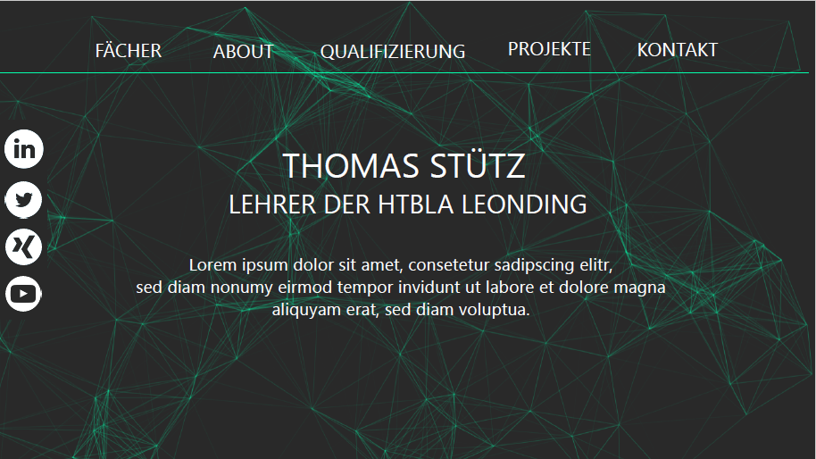
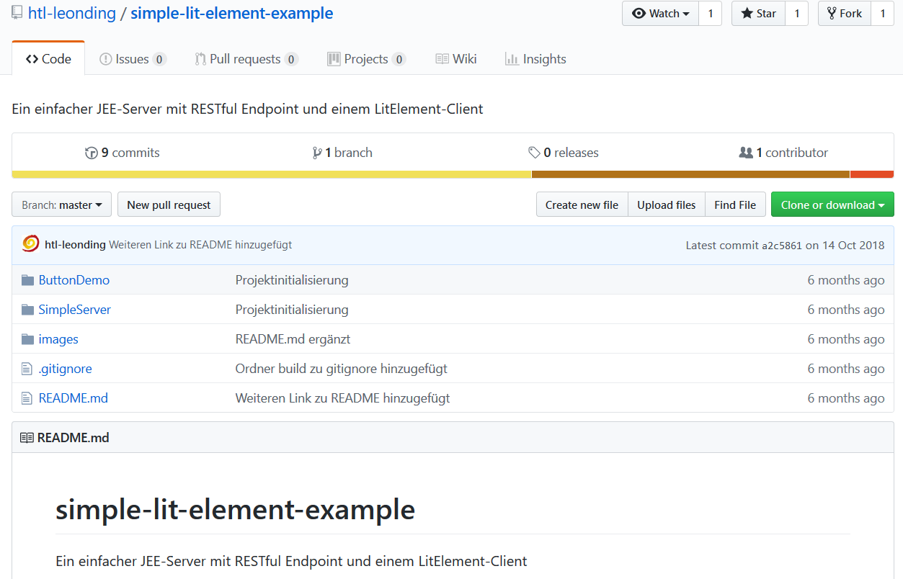
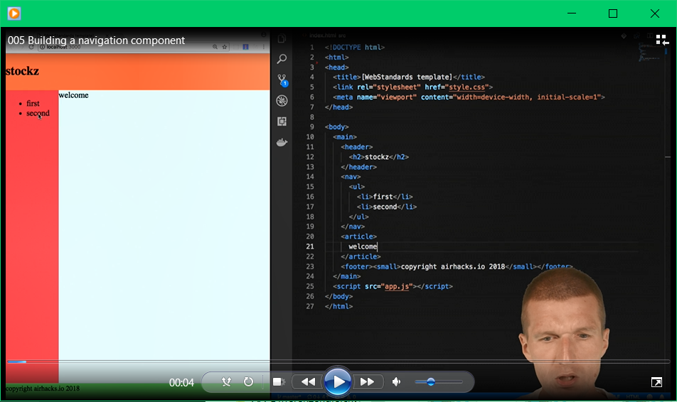

# Sachstandsbericht
### Von Konstantin Frank und David Andraschko

Unser erster Auftrag war es eine Website über Herr Professor Stütz mit GatsbyJS zu erstellen. Hier haben wir Design-Vorschläge erstellt 
, jedoch kam es dann dazu, dass wir uns das Thema für unsere Website selbst aussuchen konnten und so entschieden wir uns für eine Marketing Agentur. Wir haben ein Design erstellt und begannen die Seite mit Gatsby aufzubauen . Beim nächsten Gespräch mit Professor Stütz wurde uns der Auftrag erteilt, einen Vergleich zwischen GatsbyJS, React und Polymer (Lit-Html, Lit-Element) mit Hilfe von kleinen Websites über den Sprachavatar Leonie der HTL Leonding zu erstellen.

## GatsbyJS und React
Mit diesen beiden Technologien haben wir die Seite schon erstellt. Das Design hat dem Professor sehr gut gefallen und so haben wir direkt angefangen uns in Polymer einzulesen bzw. großteils David, weil GatsbyJS und React eher der Schwerpunkt von Konstantin war.

## Polymer
Bei Polymer haben wir uns beide anfangs schwer getan, da wir Probleme mit den Dokumentationen hatten und schnell den Überblick verloren haben. Das Polymer-Einsteigerbeispiel (Github)  haben wir beide schon gemacht und sind nun dabei über die Ferien den Polymer-Videokurs  fertig anzusehen und, wenn möglich schon mit der dritten Beispielseite anzufangen.  

Ebenfalls möchten wir die Platzhalter (Bilder) auf den anderen beiden Seiten durch Bilder von Leonie und ihrem Entwicklerteam ersetzen. 